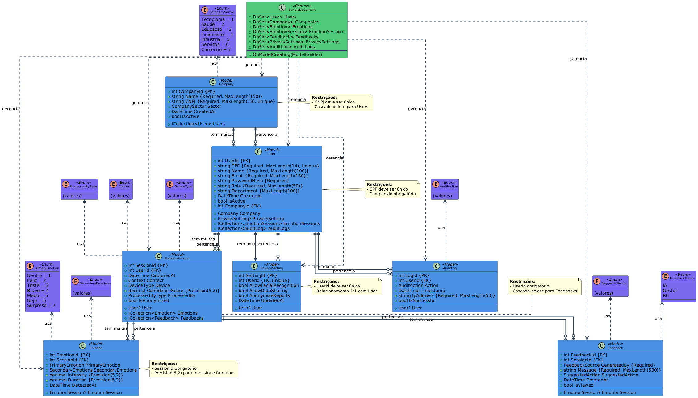

# 🧠 Eunoia

“<i>Eunoia</i>” é uma palavra grega que significa “bela mente” — usada para expressar o estado de equilíbrio entre razão, emoção e bem-estar.

## 👥 Integrantes

Os responsáveis por esse projeto são:

| Nome                             | RM     |
| -------------------------------- | ------ |
| João Antonio Rihan               | 99656  |
| Leticia Cristina Gandarez Resina | 98069  |
| Rodrigo Fernandes Serafim        | 550816 |

## 🌱 Conceito

EUNOIA é uma plataforma de IA emocional e cognitiva voltada para empresas que desejam construir ambientes de trabalho mais humanos, equilibrados e produtivos.

Ela combina análise de comportamento digital, biometria leve, machine learning emocional e feedbacks empáticos para promover o bem-estar e a empatia organizacional.

A meta é simples, mas poderosa: ajudar pessoas e empresas a pensarem, sentirem e trabalharem melhor.

## ⚠️ Problema identificado

<ul>
  <li>Aumento de burnout entre desenvolvedoras e designers;</li>
  <li>Dificuldade de comunicação entre times híbridos (home office e presencial);</li>
  <li>Falta de métricas reais sobre saúde emocional e cultura empática.</li>
</ul>

## 💡 Solução implementada

<ul>
  <li>Monitoramento voluntário de ritmo de trabalho (com opt-in).</li>
  <li>Sessões semanais de feedback emocional coletivo baseadas nos relatórios do EUNOIA.</li>
  <li>Micro Intervenções personalizadas — desde lembretes de pausa até playlists de foco criadas pela IA.</li>
</ul>

## ⚙️ Sobre a API

**Versão atual:** `v2`

O objetivo da API é armazenar informações sobre os usuários, as empresas que os usuários trabalham, emoções, feedbacks e até questões de privacidade como se permite o uso do reconhecimento de imagem ou não.

Esses dados são processados anonimamente e localmente antes de serem agregados em um painel seguro.

## 📌 Visão geral

O EUNOIA é uma API desenvolvida em .NET 10 com foco em gerenciamento de usuários, emoções, sessões emocionais, empresas parceiras, feedbacks e auditoria.

O projeto adota princípios de Clean Architecture, utilizando DTOs, Services, Repositories e Controllers bem separados para garantir escalabilidade, manutenção e organização.

A aplicação utiliza:

<ul> 
  <li>ASP.NET Core Web API</li>
  <li>Entity Framework Core (SQL Server)</li>
  <li>JWT Authentication</li> 
  <li>Repository Pattern</li>
  <li>Service Layer</li>
</ul>

## 🏛️ Arquitetura do Projeto

A estrutura segue um padrão em camadas, separando responsabilidades e facilitando testes, manutenção e evolução.

```text
EUNOIA/
│
├── Configuration/              → Configurações gerais da API
│   ├── ConfigureSwaggerOptions.cs
│   └── JwtSettings.cs
│
├── Controllers/                → Controle das rotas HTTP da aplicação
│   ├── AuditLogController.cs
│   ├── AuthController.cs
│   ├── CompanyController.cs
│   ├── EmotionController.cs
│   ├── EmotionSessionController.cs
│   ├── FeedbackController.cs
│   ├── PrivacySettingController.cs
│   └── UserController.cs
│
├── Data/                       → Contexto de banco de dados
│   └── EunoiaDbContext.cs
│
├── DTOs/                       → Transferência de dados entre camadas
│   ├── AuditLogDto.cs
│   ├── Create*.cs (Criação de entidades)
│   ├── *Dto.cs (Listagem e retorno)
│   └── *With*.cs (Relacionamentos)
│
├── Enums/                      → Tipos estáticos usados no domínio
│   ├── AuditAction.cs
│   ├── CompanySector.cs
│   ├── Context.cs
│   ├── DeviceType.cs
│   ├── FeedbackSource.cs
│   ├── PrimaryEmotion.cs
│   ├── ProcessedByType.cs
│   ├── SecondaryEmotions.cs
│   └── SuggestedAction.cs
│
├── Models/                     → Entidades principais do sistema
│   ├── AuditLog.cs
│   ├── Company.cs
│   ├── Emotion.cs
│   ├── EmotionSession.cs
│   ├── Feedback.cs
│   ├── PrivacySetting.cs
│   └── User.cs
│
├── Repositories/               → Acesso a dados (Repository Pattern)
│   ├── AuditLogRepository.cs
│   ├── CompanyRepository.cs
│   ├── EmotionRepository.cs
│   ├── EmotionSessionRepository.cs
│   ├── FeedbackRepository.cs
│   ├── PrivacySettingRepository.cs
│   └── UserRepository.cs
│
├── Security/                   → Segurança e autenticação
│   └── PasswordHasher.cs
│
├── Services/                   → Regras de negócio (Domain/Service Layer)
│   ├── AuditLogService.cs
│   ├── CompanyService.cs
│   ├── EmotionService.cs
│   ├── EmotionSessionService.cs
│   ├── FeedbackService.cs
│   ├── PrivacySettingService.cs
│   ├── TokenService.cs
│   └── UserService.cs
│
├── Migrations/                 → Migrations do Entity Framework
│
├── appsettings.json            → Configurações da aplicação
├── Program.cs                  → Ponto de entrada da API
└── EUNOIA.http                 → Arquivo para testes de requisições
```

##  Diagrama de Classes

Abaixo, está o diagrama de classes do projeto, feito em UML


<br>

## 🚀 Como Rodar o Projeto

### 📥 1. Clonar o Repositório

```text
git clone https://github.com/letyresina/EUNOIA-GlobalSolution
cd EUNOIA
```

### 🛠️ 2. Configurar o Banco de Dados (SQL Server)

O projeto utiliza SQL Server e Entity Framework Core.
Antes de rodar, verifique se você tem:

- SQL Server instalado (Developer, Express ou Docker)
- SQL Server Browser ativo (se estiver usando SQLEXPRESS)
- SSMS opcional, mas recomendado

### ⚙️ 3. Atualizar o appsettings.json

No arquivo:

```text
EUNOIA/appsettings.json
```

Localize a seção:

```json
"ConnectionStrings": {
  "EunoiaConnection": "Server=localhost,1433;Database=EunoiaDB;User Id=sa;Password=SUA_SENHA;TrustServerCertificate=True;"
}
```

#### 🔧 Ajuste conforme o ambiente do usuário:

- Se for SQLServer Local normal ou docker, pode manter o server igual

- Se for SQL express, altere server para:

```text
Server=localhost\\SQLEXPRESS;
```

⚠️ Importante: Altere a parte de Password caso utilize de uma senha diferente para o usuário sa.

### 🗄️ 4. Aplicar as Migrations

Com o banco configurado, instale a ferramenta do Entity Framework (se ainda não tiver):

```text
dotnet tool install --global dotnet-ef
```

Em seguida, navegue até a pasta do projeto e aplique as migrations:

```
cd EUNOIA
dotnet ef database update
```

### ▶️ 5. Rodar a Aplicação

Execute:

```text
dotnet run
```

ou

Ou rode pelo Visual Studio.

O Swagger estará disponível em:

```text
https://localhost:7297/swagger
```

ou

```text
http://localhost:5189/swagger
```

> **Nota:** As portas podem variar dependendo da configuração do seu ambiente. Verifique o console ao executar `dotnet run` para ver as portas exatas.
